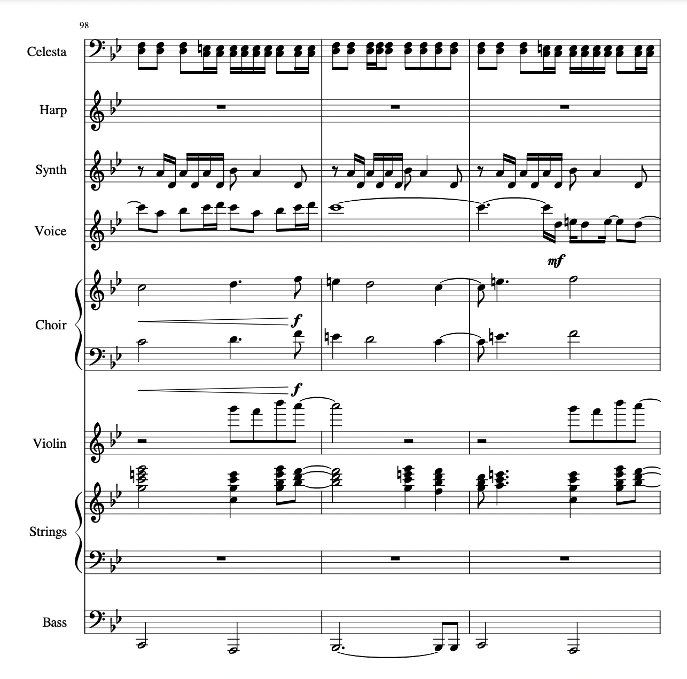

# Transcription of Unison by Björk

For this project I first transcribed each instrument into a separate MIDI track in Ableton Live, with each track containing a software instrument to emulate the part in the song. After figuring out each part in Ableton (which I chose to do because of my familiarity with the software's workflow), I then exported each MIDI file to import into MuseScore. Finally, I tuned up the score in MuseScore because the automatic notation from MIDI does not produce the most readable scores on its own. As an artifact of creating the transcription this way, I now have a (significantly worse sounding) "soundalike" of Unison from my Ableton project.




