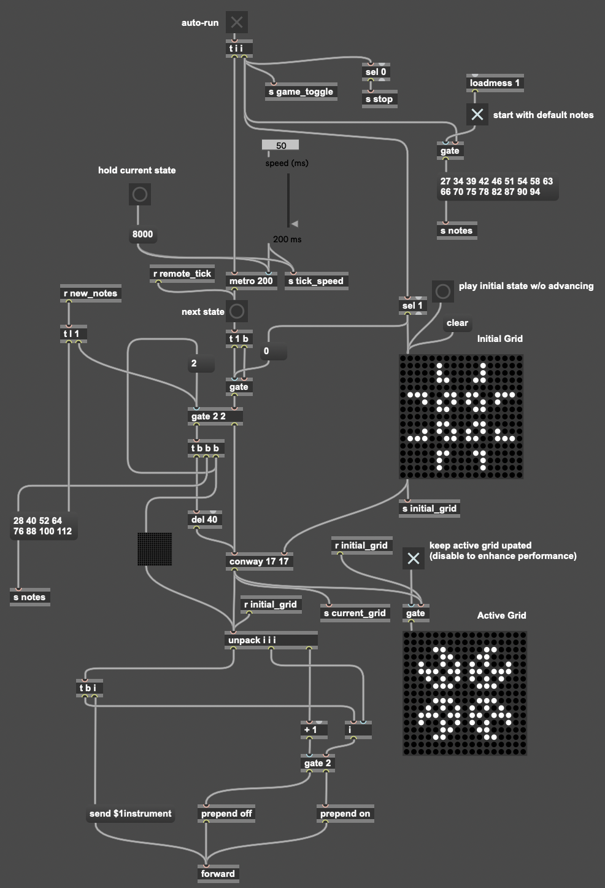

# Conway Suite

Conway Suite is a set of compositions containing musical elements that are algorithmically derived from The Game of Life, a “zero-player game” invented by mathematician John Conway in 1970. In The Game of Life, there is a grid of cells, in which each cell is either “dead” or “alive” (black or white). The state of the grid changes over time (from one “generation” to the next), based on a fixed set of rules, which are as follows.

1. Any live cell with fewer than two live neighbors (where a neighbor is an adjacent cell) dies in the subsequent generation, to simulate underpopulation.
2. Any live cell with more than three live neighbors dies in the subsequent generation, to simulate overpopulation.
3. Any dead cell with exactly three live neighbors becomes alive in the subsequent generation, to simulate reproduction.
4. All other cells stay the same.

From these simple rules, surprisingly complex visual patterns can emerge while observing one generation to the next. The goal of Conway Suite is to translate these visual patterns into musical patterns. This is achieved by playing a note for every cell that is alive, with certain musical characteristics determined by that cell’s position in the grid.
 

  <iframe width="560" height="315" src="https://www.youtube.com/embed/E1mZRs2WQw0" title="YouTube video player" frameborder="0" allow="accelerometer; autoplay; clipboard-write; encrypted-media; gyroscope; picture-in-picture" allowfullscreen></iframe>

 

_Movement I - Lifespan (0:00)_
A single Game Of Life runs until all cells die out. Live cells will play higher notes if they are more towards the top of the grid, and lower notes towards the bottom. The sound of each note produced by a cell will be closer to your left or right ear depending on which side of the grid the cell is closest to.

_Movement II - Mooncrash (00:44)_
Several Games Of Life enter and leave the composition at various times, playing notes in the same manner as Movement I. These different Game of Life grids offer the ability to each play their own instrument. Additionally, for certain instruments, the exact pitches that cells will play at certain positions in the grid can change over time, creating a chord progression.

_Movement III - Slingshot (04:52)_
A single Game of Life runs on a much larger grid, showcasing the fascinating Game of Life pattern known as the Gosper glider gun. As the grid is not infinite, the “gliders” that it produces eventually wrap around the other end of the grid and destroy the glider gun. Notes are played in the same manner as Movement I and II.

_Movement IV - Mirrors (06:27)_
Several Games of Life enter and leave the composition at various times, each playing their own instrument and utilizing chord progressions as in Movement II, but on a larger grid. Live cells will play notes in the same manner as the previous movements, with certain instruments also changing how they sound based on how far to the left or right the cell is. Additionally, the time it takes for certain instruments to proceed from one generation of the Game of Life to the next will sometimes change.

---

To create these compositions, I first wrote a [Max](https://cycling74.com/products/max) patch that runs the Game of Life, taking a starting grid and a duration as input, then updating and outputting the next state of the grid every time the duration elapses. I then connected it to an outer [Max For Live](https://www.ableton.com/en/live/max-for-live/) patch with which a user can set the starting state of the grid, the duration between generations, and run the Game of Life. This outer patch broadcasts the state of the grid every generation to other Max For Live patches listening for this state, each placed on a MIDI track in Ableton and each listening specifically for updates to a specific column of the grid. Then, if a cell in that column turns from dead to alive, the patch sends a MIDI note on message to the instrument on the Ableton track, and if a cell turns from alive to dead, it sends a MIDI note off message. (It does not send another note on message if the same cell stays alive between subsequent generations, unless the user sets it to do so). The pitch of the MIDI messages is based on the position of the cell in the column. This mapping of cell position to pitch can be set by the user (i.e. to make chords, scales, etc), so I make cells that are higher in the column play higher notes, and cells that are lower play lower notes.

These Max For Live patches, when set up correctly in an Ableton session, allow the user to compose music algorithmically derived from the Game of Life. The grid running based on the composer's parameters sends the state of each column to different MIDI tracks, which each play notes on their instrument based on the cells that are currently alive in that column. This means the vertical axis of the grid affects pitch, and the horizontal axis can affect any other musical property the composer decides, simply by giving each MIDI track unique parameters on the instrument and/or mixer. For example, in all movements of Conway Suite, I gave each MIDI track (a.k.a. each column) a unique panning value, so that more leftward cells play notes panned closer to the left ear, and more rightward cells play closer to the right ear. For certain parts of Movement IV, I also used instruments with a slightly different timbre on each MIDI track, so that the note that is played sounds different based on its horizontal placement within the grid.

After setting this all up, I started experimenting to see how different grids sound, with different starting states, sizes, speeds, pitch mappings, and instrument parameters on each MIDI track. For the movements that involve different grids entering and leaving the composition at various times, I gave the composition long-term structure by creating an arrangement of recordings of these different grids running with their unique parameters. For these longer movements, I also change the pitch mapping of certain grids over time, creating a chord progression from the notes playing from that grid. For Movement IV, I also change the duration between generations of certain grids over time, resulting in instruments playing with varying rhythms, or speeding up and slowing down. To create the video that accompanies Conway Suite, I screen recorded each grid (a Max GUI object) playing each part, then arranged these parts in Adobe Premiere.

Using the link to the GitHub repository below, you can view and download these Max patches, along with more detailed instructions on how to set them up within an Ableton session to compose your own music algorithmically derived from Conway's Game of Life.

  

  <em>A glimpse into one of the Max patches</em>

