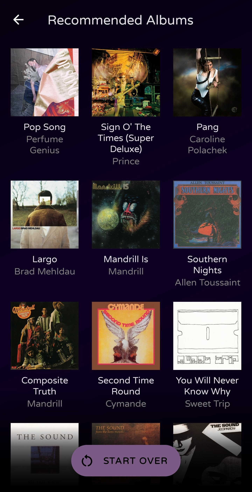

# Libzy

Sitting at my desk all day for work and wanting to enhance the experience by taking full advantage of my broad and eclectic music taste -- along with my preference for listening to full albums -- while Spotify's home page kept recommending me the same albums over and over which it already knew I liked, an idea was born. I had already been interested in trying full scale Android development after my brief and surface-level experience with the platform while working at Bose, so I decided a great way to learn -- and kill two birds with one stone -- would be to develop the app I wish existed. A way to search through your "digital record collection" to find something to listen to based on your current mood. Using Spotify's API as a rich source of data, including genre associations and measurements of various musical properties such as danceability or instrumentalness, along with Spotify's Android SDK for authorizing the user and playing albums remotely on Spotify without leaving my own app, I created Libzy.

It has been immensely satisfying to use my app to fulfll my own use case, and I know there are many other music listeners out there who, like myself, prefer listening to albums straight through and have a diverse collection. I believe this app will be useful to many such music enthusiasts, ranging from younger generations who do not have a physical record collection to older generations who do but would like to digitize their collection for more convenient listening, and use the power of software to make a selection from it based on filtering through metadata according to their current mood, rather than aimlessly thumbing through shelves and shelves of records or CDs. Recommendation systems for discovering new music have already been done and done well. What is lacking out there for music lovers is the ability easily find things within your own large collection, particularly albums that you may not listen to all the time but still have saved -- maybe after one enjoyable listen or maybe after a recommendation from a friend that you have been meaning to listen to at some point.

If this app sounds useful to you, please try it out using the link below! It is currently still in alpha, but after some more testing and enhancements, it will soon be ready for a full release on the Google Play Store.




