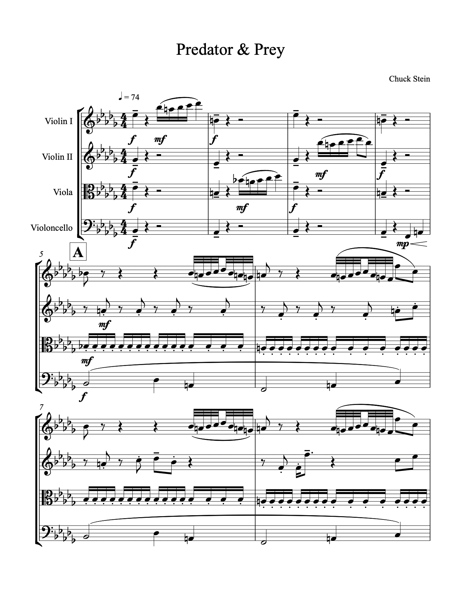

# Predator & Prey - An Original String Quartet

This is a short composition for two violins, a viola, and a cello, loosely based on the sonata form. I wrote the piece using four MIDI tracks in Ableton Live,
as that is the workflow with which I can most efficiently compose music, due to my familiarity with the software. I then exported the MIDI files
into more traditional notation software, Sibelius, and refined it from there to add details like dynamics and make the parts more readable.
The [Cuarteto Latinoamericano](https://en.wikipedia.org/wiki/Cuarteto_Latinoamericano) performed a read-through of the piece on March 25th, 2019.
As it was only a sight reading (so they did not rehearse the piece beforehand), it is naturally not a 100% accurate representation of the score,
however they were still surprisingly accurate and it sounded great. You can listen to this performance below.

 

  <audio controls src="../assets/projects/string-quartet/string-quartet-performance.mp3">
    <!-- fallback -->
    
Your browser does not support HTML5 audio, but you can still <a href="../assets/projects/string-quartet/string-quartet-performance.mp3">download the recording</a>.

  </audio>

 

  

  
  
  
  

